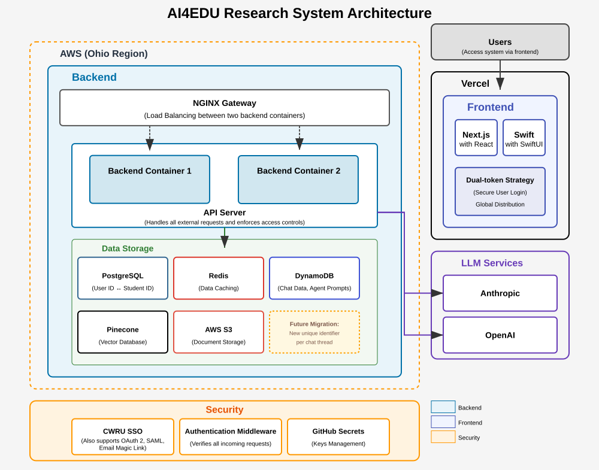

This time last year, I was deep in research meetings, trying to answer one deceptively simple question: how can we help students learn better with the help of AI?

The idea started as a collaborative research project at Case Western Reserve University. We set out to build more than a chatbot for professors. We wanted something that could support student learning by organizing, surfacing, and helping answer academic questions across multiple courses. The goal was **an assistant that scaled** and made it easier for students to get unstuck.

---

### What We Set Out to Solve

In every course, there are always unanswered questions, and students don't always know where to ask them, how to find prior answers, or how to articulate them clearly. Professors, meanwhile, are overloaded. We asked:

- What if students could get help *faster*, with AI surfacing the most relevant content from past questions and course materials?
- What if we made question answering collaborative, transparent, and reusable?
- What if the system itself could scaffold learning, rather than just automating replies?

Our AI assistant was designed to do just that.

---

### Building the Stack

We started small:

| Layer       | Stack                                                     |
|-------------|-----------------------------------------------------------|
| **Frontend** | Next.js for the web, SwiftUI for iOS                     |
| **Backend**  | FastAPI, PostgreSQL, and a Pinecone vector store        |
| **Auth**     | University SSO using JWT + role-based access control    |
| **LangChain**| Multi-hop retrievers, summarizers, prompt pipelines     |
| **CI/CD**    | Vercel + GitHub Actions for fast iteration               |

One technical breakthrough was the **Retrieve Merger**, a retrieval layer that pulled answers from multiple indexed sources (lecture notes, transcripts, syllabus) and re-ranked them based on student context.

We also built namespace-aware indexing in Pinecone to support multi-tenant deployments across courses and institutions.

---

### Teaching With AI

The assistant was meant to **amplify** instructors, not replace them.

- Students could **ask natural language questions** and receive summarized, contextual answers based on approved sources.
- The system promoted **retrieval over memorization**, encouraging students to learn how to ask better questions.
- Professors used it to **triage and guide class discussions**, surfacing common themes and confusion areas.
- The feedback loop between **AI insights and instructional strategy** helped educators adjust materials on the fly.

---

### Lessons from Production

1. **Start simple.** Our earliest version didn't generate answers. It just organized and indexed questions. But that alone created real value.
2. **Students teach the system.** The way students phrase questions shaped how we built retrievers and prompt logic. Their input made the system smarter.
3. **Keep teachers in the loop.** Our best results came when teachers stayed involved and used the assistant to extend their reach.

---

### What I'm Proud Of

It started as an experiment and ended up part of students' daily routine. Students found answers on their own more often, and instructors spent less time repeating themselves.

It's still evolving, but this project showed me that AI is most useful in a classroom when it **helps the people already there** instead of trying to stand in for them.

And if even one student found an answer that helped them keep going, that makes it all worth it.