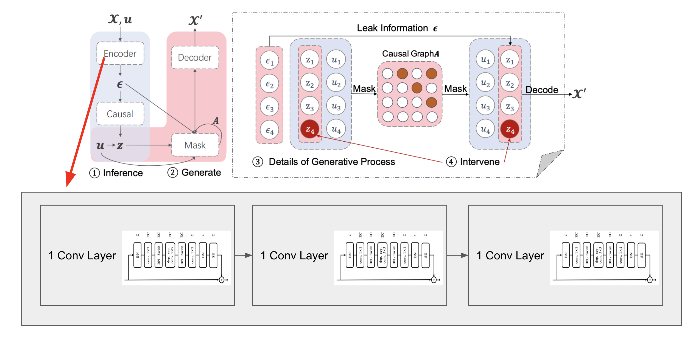
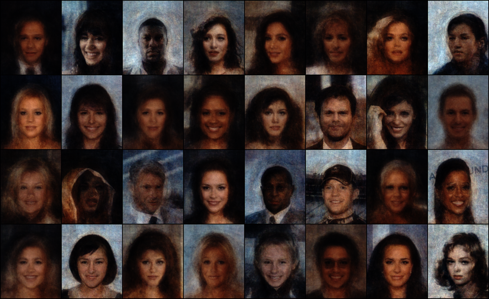

## CausalVAE for Image Inpainting

This project introduces a novel approach to image inpainting by integrating causal reasoning within generative processes. By combining Variational Autoencoders (VAEs) with Structural Causal Models (SCMs), we've developed a model that enhances semantic coherence and realism in reconstructed images.

---

## Project Overview

Image inpainting—the task of filling in missing or damaged regions of images—has numerous applications in digital forensics, image restoration, and object removal. While traditional methods can produce visually plausible results, they often struggle to maintain semantic coherence.

Our research addresses this limitation by incorporating causal structures into the generative process, enabling more meaningful and contextually appropriate reconstructions.



---

## Key Innovations

Our approach builds upon existing work in both generative models and causal inference:

* **Causal Layer Integration**: We adapted the Causal Layer from CausalVAE and enhanced it with structural elements from NVAE
* **Scaled Training**: Implemented techniques to scale up training for larger image sizes and feature groups
* **Structural Consistency**: Developed methods to maintain training stability while preserving causal relationships

This combination allows our model to understand not just visual patterns but the underlying causal relationships between image features.

---

## Technical Challenges

Three primary challenges were addressed in this research:

### 1. Creating Expressive Neural Networks

We designed network architectures capable of capturing the complex relationships between image components while maintaining computational efficiency.

### 2. Scaling Up Training

Processing higher-resolution images with more complex causal structures required innovations in training methodologies and optimization techniques.

### 3. Maintaining Training Stability

Balancing the VAE's reconstruction objectives with the causal model's structural constraints presented unique stability challenges.

---

## Experimental Results

Our experiments demonstrate significant improvements over traditional VAE-based inpainting methods:

* **Enhanced Semantic Coherence**: Objects and scenes reconstructed by our model maintain logical relationships and contextual appropriateness
* **Improved Realism**: The incorporation of causal reasoning leads to more natural-looking reconstructions
* **Interpretable Latent Space**: Our approach produces a more structured and interpretable latent representation




---

## Implementation Details

The code for this project is structured around several key components:

```python
# Core model architecture combining VAE with causal layer
class CausalVAE(nn.Module):
    def __init__(self, latent_dim, causal_dim):
        super(CausalVAE, self).__init__()
        self.encoder = Encoder(latent_dim)
        self.decoder = Decoder(latent_dim)
        self.causal_layer = CausalLayer(latent_dim, causal_dim)
        
    def forward(self, x, mask=None):
        z, mu, logvar = self.encoder(x)
        causal_z = self.causal_layer(z)
        reconstruction = self.decoder(causal_z)
        
        # Apply mask for inpainting if provided
        if mask is not None:
            reconstruction = x * mask + reconstruction * (1 - mask)
            
        return reconstruction, mu, logvar, causal_z
```

The causal layer implements a structural causal model that captures relationships between latent variables:

```python
class CausalLayer(nn.Module):
    def __init__(self, latent_dim, causal_dim):
        super(CausalLayer, self).__init__()
        self.fc = nn.Linear(latent_dim, causal_dim)
        self.adjacency_matrix = nn.Parameter(torch.zeros(causal_dim, causal_dim))
        
    def forward(self, z):
        causal_variables = self.fc(z)
        # Apply causal structure using adjacency matrix
        causal_effect = torch.matmul(self.adjacency_matrix, causal_variables.unsqueeze(-1)).squeeze(-1)
        return causal_effect
```

---

## Applications

Our approach has potential applications in:

* **Digital Image Restoration**: Recovering damaged historical photographs with contextually appropriate details
* **Medical Imaging**: Reconstructing incomplete medical scans while maintaining anatomical correctness
* **Content Creation**: Enabling more intelligent object removal and scene editing for creative professionals
* **Digital Forensics**: Providing more reliable image reconstruction for forensic analysis

---

## Challenges and Future Work

While our approach shows promising results, several challenges remain:

* **Computational Complexity**: The addition of causal structures increases training time and resource requirements
* **Causal Discovery**: Automatically learning causal structures from data remains challenging
* **Evaluation Metrics**: Developing better quantitative measures for semantic coherence in inpainted regions

Future work will focus on addressing these limitations and exploring applications in video inpainting and 3D reconstruction.

---

## Conclusion

Our research demonstrates the potential of integrating causal reasoning with generative models to enhance image inpainting. By enabling the model to understand causal relationships between image features, we achieve reconstructions that are not only visually plausible but also semantically coherent and realistic.

This project represents a step toward more interpretable and reliable generative models for computer vision tasks. 