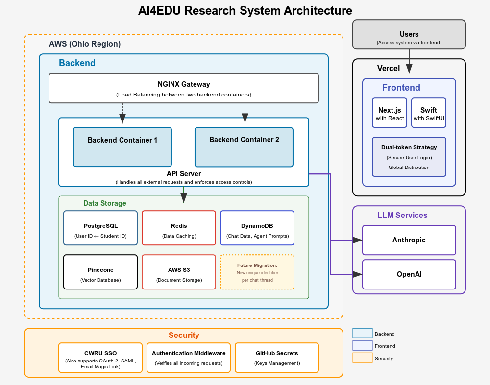
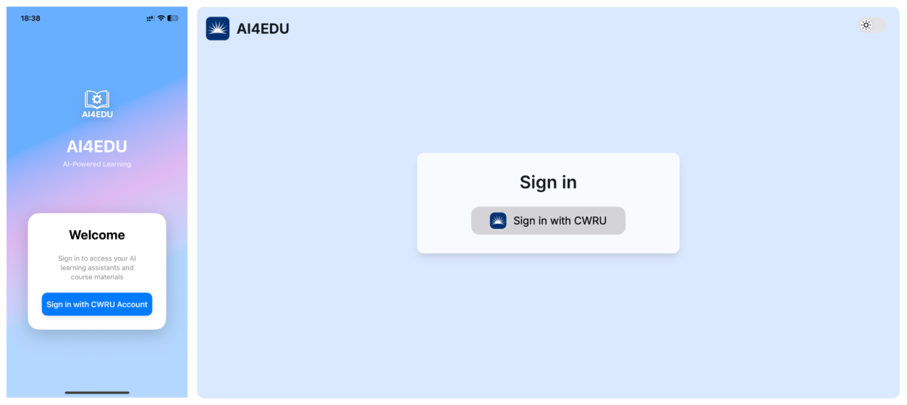
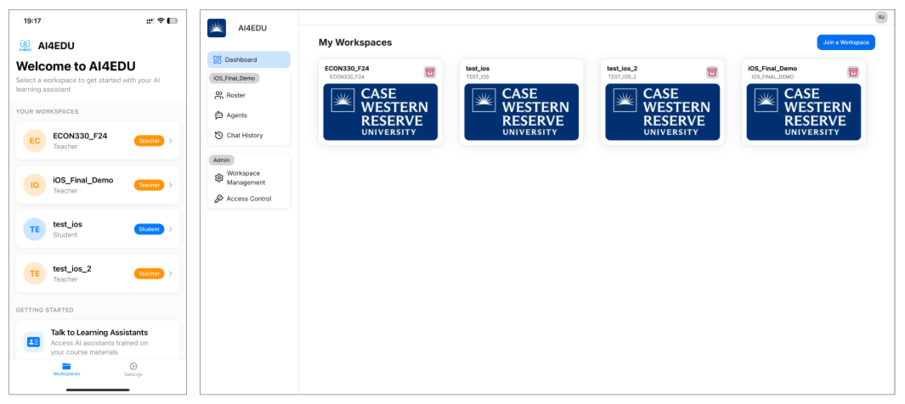
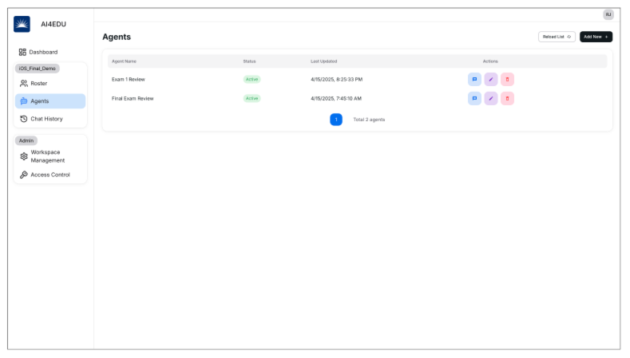
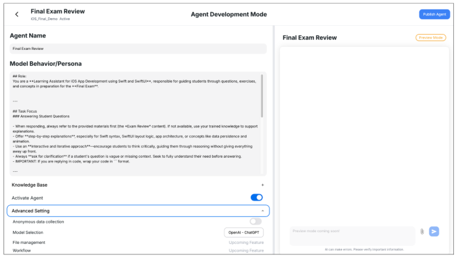
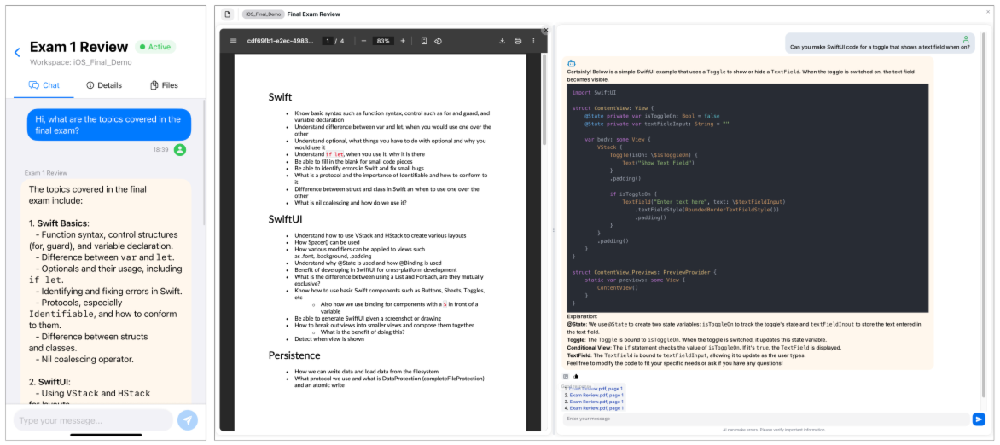
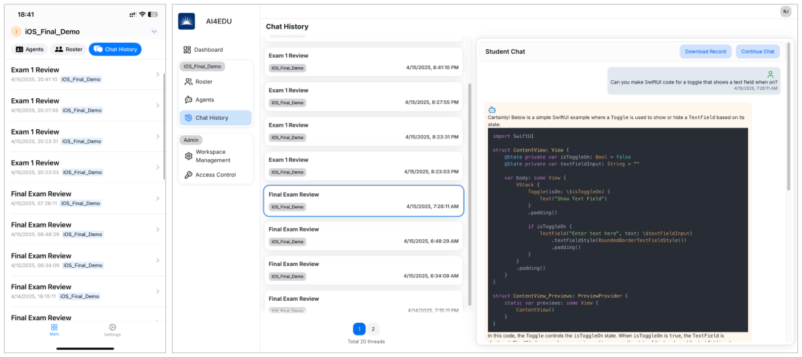
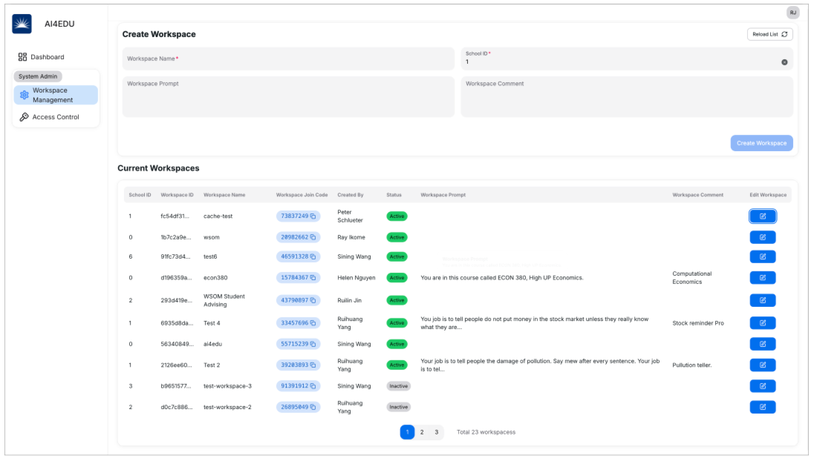
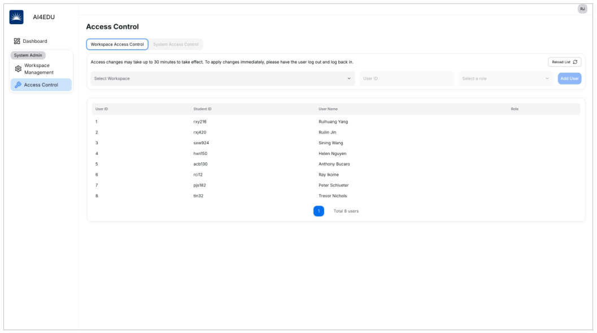
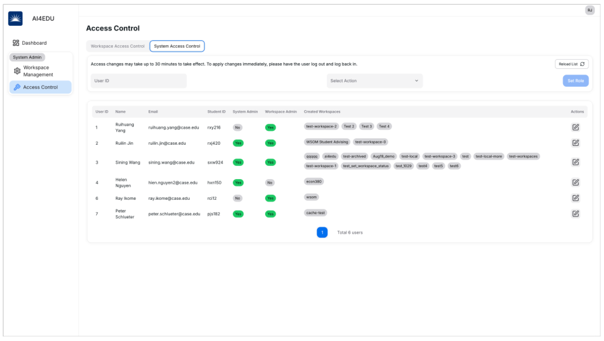

## AI4EDU

AI4EDU is a platform we've developed at Case Western Reserve University to enhance educational experiences through AI-powered assistants. Supporting students, instructors, and researchers in various learning contexts, AI4EDU integrates intelligent agents directly into course workspaces. This case study demonstrates the system's end-to-end functionality.

---

## System Structure Overview

The platform supports multiple institutions, courses, and roles. Key components include:

* **Login and session management**
* **Role-based workspace organization**
* **Customizable AI agents with editable personas**
* **Document-linked chat interfaces**
* **Comprehensive admin controls for access management**

---

## Login

Users access the platform using their university credentials, enabling role-specific routing—presenting tailored interfaces for students, instructors, and administrators.

---

## Dashboard

Upon login, users are presented with a streamlined dashboard displaying all their associated workspaces:

Each card represents a distinct course or use case (such as ECON330 or iOS Final Review). Administrators have additional navigation options for workspace management and system configuration.

---

## Agents Page

Workspaces can host multiple specialized AI agents. The Agents panel enables users to preview, interact with, and publish these assistants. These agents provide:

* Chat, edit, and delete options for instructors
* Chat-only access for students

---

## Create/Edit Agents

Administrative users and instructors can define and customize agent behavior through the intuitive agent editor:

Agent personas are highly configurable:

* Adjustable tone and expertise levels
* Integration of course-specific knowledge
* Customizable interaction guidelines (citation requirements, critical thinking prompts)

---

## Chat Page: AI-Powered Interaction

Students engage with active agents within the workspace through the chat interface, which features:

* **Integrated file viewer**: Displays relevant documents alongside the chat for contextual reference
* **Source attribution**: Agents can reference specific content sections directly
* **Interactive feedback**: Users can rate responses, suggest improvements, and flag issues for review

---

## Fully Anonymous Chat History

Student privacy is maintained through anonymous chat history storage. While usage patterns are available for analysis, individual conversations remain untraceable to specific users.

---

## System Admin: Workspace Management

Administrators can create and manage course workspaces through the comprehensive Workspace Management interface:

Each workspace includes:

* Unique identification and access credentials
* Customizable agent objectives
* Configurable operational status

---

## Access Control: Fine-Grained Permissions

The platform implements dual-layer access control:

### 1. Workspace Access Control

Administrators assign role-specific permissions within individual workspaces: 

### 2. System Access Control

Platform-wide roles (System Admin, Workspace Admin) are managed through system-level controls:

This structure ensures appropriate privilege separation across user categories throughout the platform.

---

## Role-Based Access Control (RBAC)

AI4EDU implements a sophisticated Role-Based Access Control system to manage permissions across the platform. This ensures users only access features and data appropriate to their designated role.

Key roles include:

* **Student**: Interact with agents, access materials, provide feedback
* **Instructor**: Develop agents, manage content, review analytics
* **Workspace Admin**: Oversee workspace operations and user roles
* **System Admin**: Manage platform configuration, user provisioning, and system auditing

RBAC enforcement occurs at both workspace and system levels, providing flexibility while maintaining security boundaries.

---

## iOS Support

AI4EDU extends learning opportunities through iOS compatibility. The responsive interface optimizes for iPad and iPhone use, allowing students to:

* Engage with course agents on mobile devices
* Access study materials anywhere
* Utilize course materials preparation resources remotely

This mobile integration ensures educational support remains accessible throughout students' daily activities.

---

## ✅ Summary

AI4EDU delivers a modular, privacy-focused learning platform built around specialized AI agents supporting:

* Interactive examination preparation
* Virtual academic support services
* Enhanced research workflows

Each agent operates within a dedicated workspace, with role-based access control and extensive customization options.

> 🌱 Coming next: agent versioning capabilities, collaborative learning tools, and research-oriented export functions.

